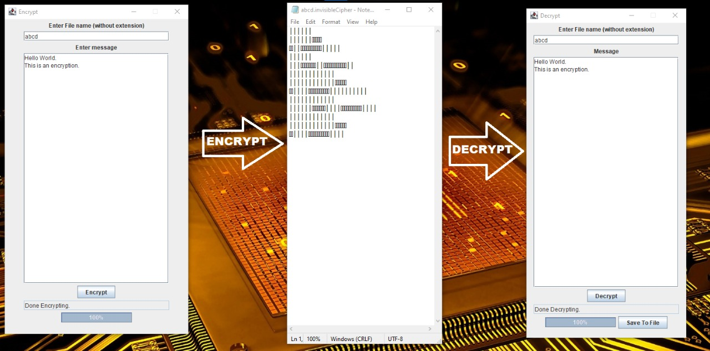

# InvisibleEncryption
This program encrypts a text or a text file into a format that cannot be read by human as the characters are non-graphic. Moreover, the use of recursive Encryption algorithm makes it difficult even for a computer to break the encryption.
The Screenshot image gives an insight about the algorithm.

To run the program, download it as a zip, run the Main class. The default login password is '1234'. Don't increase the Layers of Encryption beyond 8, it makes the database initialization extremely slow.

